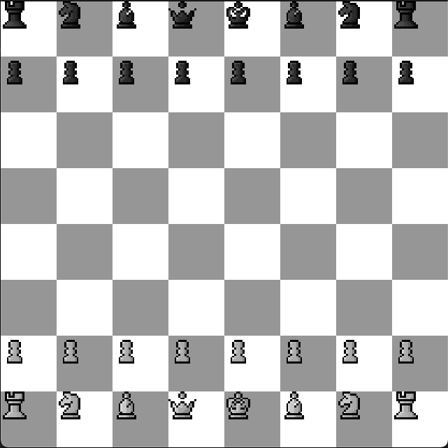
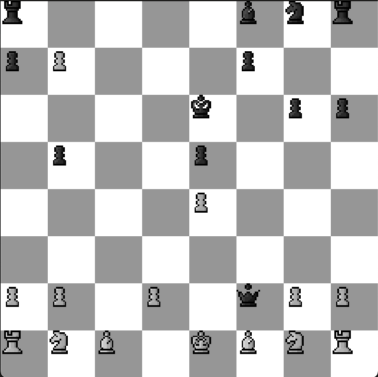
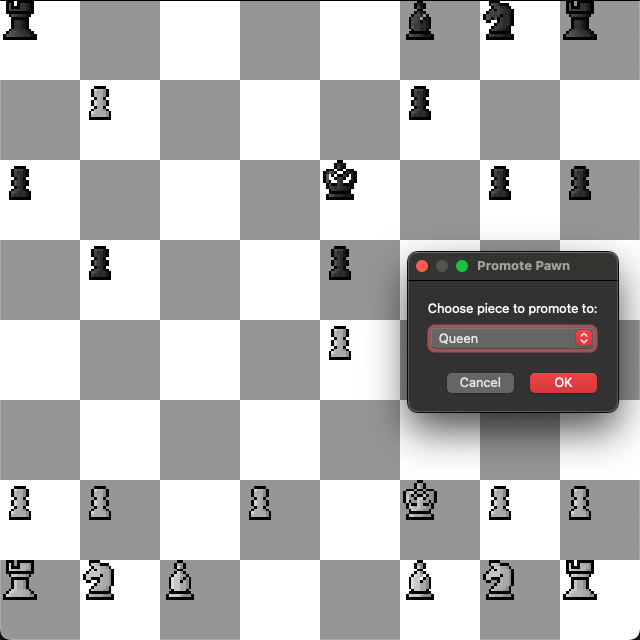
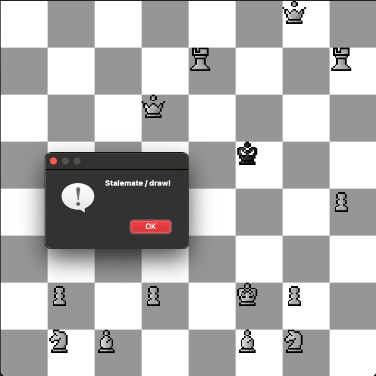

# Chess AI with Deep Q-Learning (DQN) and Qt GUI  

This is a **Chess AI** project that combines **Deep Reinforcement Learning (DQN)** with a **Qt-based GUI** for an interactive chess experience. The AI learns and improves through **reward-based training** while playing against human players or itself.  

## 📌 Features  
- **Graphical Chessboard** with Qt5  
- **AI-powered Chess Agent** using **Deep Q-Learning**  
- **Full move legality validation** (including castling, en passant, pawn promotion)  
- **Pawn promotion with selection dialog**  
- **Game state evaluation** (Checkmate, Stalemate, Insufficient Material)  
- **Replay Buffer** for AI learning  
- **Trained Model Persistence** (Saves & loads AI progress)  
- **Custom Reward Engineering** for optimal decision-making  

## 🚀 Installation  

### **1️⃣ Install Dependencies**  
Ensure you have **C++17**, **CMake**, **Qt5**, and **LibTorch** installed.  
On **macOS (Homebrew)**:  
```sh
brew install cmake qt@5
```

## Clone and Build the project
```sh
git clone https://github.com/jeffbyju/chess-ai.git
cd chess-ai
mkdir build && cd build
cmake -DCMAKE_BUILD_TYPE=Release \
      -DCMAKE_PREFIX_PATH=/path/to/libtorch \
      -DQt5_DIR=/path/to/qt5/cmake ..
make
```
## Run the project

```sh
./ChessDQNQt
```




